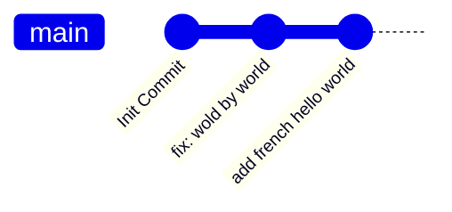

## Git c'est quoi

Git est un logiciel de gestion de versions.

Il sert à :

  - Suivre les modifications de ton code/dossier 

  - Travailler en équipe sans écraser le travail des autres

  - Revenir en arrière si tu casses quelque chose.

{}
NOTE!

Git est par défaut une plateforme, décentralisez (pas de serveur unique pour héberger) ce qui rend son utilisation complexe. 

C'est pour ça qu'il existe des projets comme GitHub et GitLab qui centralisent les repos. Mais rien ne vous empêche d'utiliser les deux en même temps ce qui ne serait pas possible sur un vraie plateforme centralisé

{}


{}

**Debian/Ubuntu/Mint Content**

```sh
sudo apt install git -y
```

{}
{}

**Arch Content**

```sh
sudo pacman -S git -y
```

{}
{}

**Windows Content**

{}

N'utilisez pas winget si vous l'avez installée d'une autre manière 

{}

```sh
winget install -e --id Git.Git
```

{}



## Configuration de Git

```bash
git config --global user.name "TonNom"
git config --global user.email "tonemail@example.com"
```

{}

Utilisez la même adresse mail sur github ou gitlab. C'est donnée sont visibles par tout le monde

{}

## Créer votre premier projet

Il existe deux moyen de créer un projet 

1. Local : Le local est bien pour ajouter un projet qui existe, mais sans versioning
2. Centraliser : Si vous démarrez un tout nouveau projet et compter utiliser git. Alors créer directement avec une plateforme, centralisez est plus aisée


{}


**Local**
```sh
git init
```
{}

Félicitation, vous avez créé votre premier projet

{}

Mais maintenant, on aimerait ajouter ce projet à une plateforme de centralisation.
Pour ça il faut vous rendre sur la plateforme de votre choix Github ou GitLab

Maintenant créer un repo sur la plateforme.

{}

À la création du repo désactiver toutes les options qui générer du contenu

Exemple :
- README
- .gitignore

Si vous ne le faites pas, vous risquez d'avoir des conflits, c'est gérable, mais vous n'avez pas envie de le faire, croyez-moi.
{}

Une fois le repository créer, vous devrez voir les instructions pour synchroniser votre projet local et centraliser

{}

Vous risquez d'avoir une erreur de droit d'accer.
Pour ça vous deverez créer une clef [ssh](/docs/git/ssh) voir la doc [ici](/docs/git/ssh)
{}

{}
{}

**GitHub/GitLab**

{}

Avant de commencer, vous devez créer votre clef [ssh](/docs/git/ssh) voir la doc [ici](/docs/git/ssh)

{}

Maintenant que vous avez créé votre clef SSH il vous faut mettre, créer un repository.

Lors de la création de votre repo laisser la case `add README` activer ça permet d'ajouter une description
ou des instructions, c'est une bonne pratique en informatique.

Une fois votre repository créer, vous devrez avoir un bouton `Code` ou `Download` déroulez le menu est copié le lien `ssh`

Il vous reste plus qu'a cloné votre repo comme suit
```sh
git clone git@url:infocomplementaire
```

{}

Félicitation, vous avez créé votre premier projet

{}

{}


## Premier pas

Super maintenant qu'on à notre projet il serait bien de pouvoir s'en servir correctement

### Les commits

Un commit est une instance dans votre dépôt git l'objectif, c'est de montrer les modifications apportées par qui, pour quoi et quand.

Illustrons ceci avec un exemple

Imaginons que je fasse un hello world en python, mais que j'oublie le `r` de `world`

mon programme ressemblera à ceci

```python
def bonjour()
  print("Hello wold")

bonjour()
```

Maintenant corrigeons le code en rajoutant le r et faisons un `git diff` pour voir les modifications tout de suite



def bonjour()
  print("Hello wold") # Ancient code
  print("hello world") # Nouveau code

bonjour()


cette différence, elle est faite pour chaque commit pour nous montrer rapidement ce que l'utilisateur à modifier

créont notre commit pour voir
```sh
git add python.py # Il faut inclure les fichier dans un commit
git commit -m "fix: wold by world" # Le nom de notre commit
git push # Pour l'envoyer sur github ou gitlab
```

faisons un `git log`

```log
commit 736f6fd48e7c4f3ea34625a0040b1a489f48e907 (HEAD ->
 master)
Author: DaemonWhite <daemonwhites@vivaldi.net>
Date:   Mon Sep 29 09:42:19 2025 +0200

    fix: wold by world

commit 7be432a97de20836ab35c301d82389860b5e7989 ## référence de notre commit 
Author: Michel <michel@vivaldi.net> ## Qui la modifier
Date:   Mon Sep 29 09:27:51 2025 +0200 ## Quand

    Init commit ## Nom du commit
```

Pour voir la différence on fait un 
`git show 736f6fd48e7c4f3ea34625a0040b1a489f48e907`


commit 736f6fd48e7c4f3ea34625a0040b1a489f48e907 (HEAD -> master)
Author: DaemonWhite <daemonwhites@vivaldi.net>
Date:   Mon Sep 29 09:42:19 2025 +0200

    fix: wold by world

diff --git a/python.py b/python.py
index 81a9525..8cde782 100644
--- a/python.py
+++ b/python.py
@@ -1 +1 @@
-print("hello wold")
+print("hello world")
```


{}

NOTE!

L'intérêt des commits, c'est la traçabilité,. Imaginons que vous créez une classe personnage dans votre jeu.

Et qu'un tiers le modifie pour améliorer sa vitesse de déplacement. 

Mais la nouvelle méthode de déplacement a apporté un nouveau bug.

Grâce au commit, on pourra mieux comprendre ce qu'il a fait pour le corriger ou le retourner dans un état antérieur.
{}


Les commits peuve êtres représenter par un arbre linéaire

